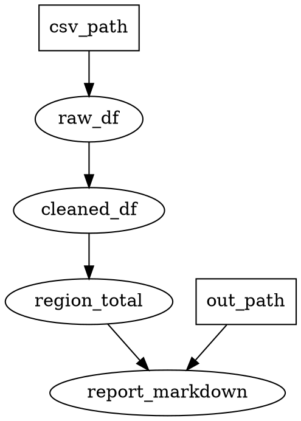

# quickstart：核心模型与第一个 DAG

Hamilton 把「一组带类型注解的 Python 函数」自动组装成 DAG。不需要显式声明边——**连线由名字匹配完成**。

## 函数 ↔ 节点对照

| Python 组件 | DAG 组件 |
|---|---|
| 函数名 | 节点名 / 输出变量名 |
| 参数名 + 类型注解 | 上游依赖（连接到同名节点的输出） |
| docstring | 节点说明（自省/可视化时展示） |
| 返回类型注解 | 输出类型 |
| 函数体 | 节点计算逻辑 |

硬性规则（实测验证）：

- **参数和返回值都必须有类型注解**。缺返回值注解的函数会在 build 时直接报错：
  `ValueError: Missing type hint for return value in function <名>`
- **下划线前缀的函数不收录**——`_md_table` 这类私有助手函数这样命名。
- **函数名在模块内全局唯一**：函数名 = 输出变量名，重名即冲突。
- 模块级常量（如 `NUMERIC_COLS`）不是节点，节点函数体内可自由引用。
- 中文列名/中文函数名是合法 Python 标识符，可直接用；惯例是英文函数名 + 中文 docstring。
- **不要改上游输入**：上游结果可能被缓存/复用，原地修改会污染别处；要改先 `copy()`：

```python
# ❌ 直接在上游 DataFrame 上加列
def add_ratio(df: pd.DataFrame) -> pd.DataFrame:
    df["达成率"] = ...
    return df

# ✅ 复制后修改
def add_ratio(df: pd.DataFrame) -> pd.DataFrame:
    out = df.copy()
    out["达成率"] = ...
    return out
```

## 运行时输入

参数名在模块中找不到同名函数输出时，它就是**运行时输入**，由 `execute(inputs=...)` 提供：

```python
def raw_sales(csv_path: str) -> pd.DataFrame:  # csv_path 是运行时输入
    """读取 BI 导出的原始 CSV"""
    ...
```

## 设计先行：DOT 草图

写代码前先用几行 DOT 把 DAG 画出来——比代码省 token，结构一眼可查，写完机械翻译成签名：



翻译规则：**节点 → 函数名，入边 → 参数，出边 → 返回值**。签名写完先跑 `--list-nodes`
（build 即校验，不执行任何节点），依赖接错、拼写错在这一步暴露，通过后再填函数体。

## Driver 与执行

```python
from hamilton import driver

dr = driver.Builder().with_modules(模块对象).build()   # 组装 DAG（此时不执行任何节点）
results = dr.execute(
    ["report_markdown"],                                # 只请求最终变量
    inputs={"csv_path": "out/x.csv", "out_path": "reports/x.md"},
)
# execute 只计算所请求变量的上游子图；没被依赖的节点不会跑
```

单文件脚本传 `with_modules(__main__)`，**块内必须先 `import __main__`**（详见 pitfalls.md）。

## 自省

```python
for var in dr.list_available_variables():
    print(var.name, var.tags)
# 运行时输入（如 csv_path）也会列为变量；@check_output 会额外展开出
# <节点名>_raw 与 <节点名>_<校验器> 节点，属正常现象

# 依赖排查（返回 Node 列表，均含自身）：
dr.what_is_upstream_of("report_markdown")    # 它依赖谁
dr.what_is_downstream_of("cleaned_sales")    # 谁依赖它
```

## 最小骨架（抽象自 scripts/kolon_report.py）

```python
import pandas as pd


def raw_df(csv_path: str) -> pd.DataFrame:
    """读原始数据"""
    return pd.read_csv(csv_path, encoding="utf-8-sig")


def clean_df(raw_df: pd.DataFrame) -> pd.DataFrame:
    """清洗：数值列转 float，不可解析值 → NaN"""
    return raw_df.dropna()


def region_total(clean_df: pd.DataFrame) -> pd.DataFrame:
    """按区域聚合流水"""
    return clean_df.groupby("区域", as_index=False)["流水"].sum()


def report_markdown(region_total: pd.DataFrame, out_path: str) -> str:
    """生成 markdown 报告并写盘，返回全文"""
    ...


if __name__ == "__main__":
    import __main__

    from hamilton import driver

    dr = driver.Builder().with_modules(__main__).build()
    dr.execute(["report_markdown"], inputs=dict(csv_path="out/x.csv", out_path="reports/x.md"))
```

## 把现有 pandas 脚本转成 DAG

拿到一段现成脚本时，把每个赋值语句翻成一个函数：

| 脚本写法 | DAG 写法 |
|---|---|
| `df = pd.read_csv(p)` | `def raw_df(csv_path: str) -> pd.DataFrame` |
| `df = df.dropna()` | `def clean_df(raw_df: pd.DataFrame) -> pd.DataFrame` |
| `s = df.groupby("区域")["流水"].sum()` | `def region_total(clean_df: pd.DataFrame) -> pd.DataFrame` |
| `print(...)` / `df.to_csv(...)` | 终端节点 `report_markdown`，或留在 `__main__` 块 |

要点：函数名 = 该步产出；上一步的产出 = 下一步的参数名（按名自动连线）；
脚本里的全局常量改成运行时输入或模块常量。

---

加校验/参数化/按配置切换节点 → `decorators.md`；数据读入清洗与产物落盘约定 → `data-io.md`。
